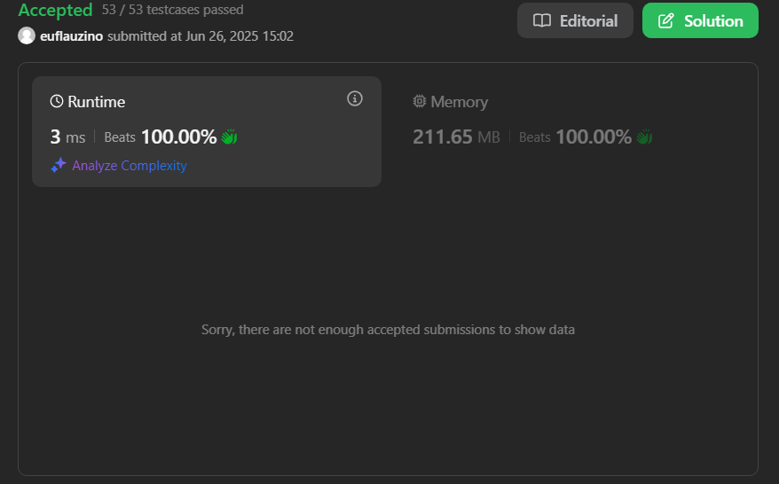
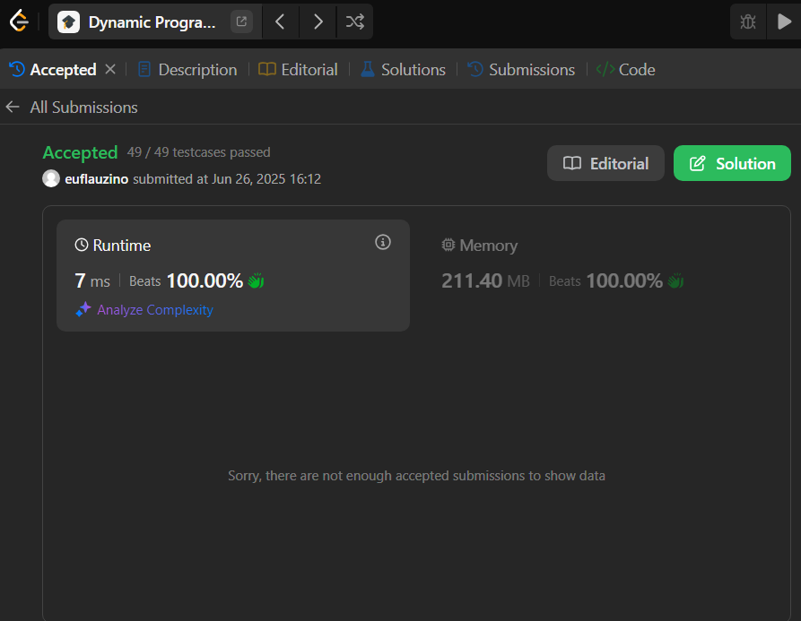

# LeetCode

**Número da Lista**: 5 
**Conteúdo da Disciplina**: Programação Dinâmica  

## Alunos
|Matrícula | Aluno |
| -- | -- |
| 22/2006178 | Thales Henrique Euflauzino dos Santos  |
| 22/2021924 | Víctor Hugo Lima Schmidt               |

## Sobre 
Para explorar o conteúdo do tópico de Programação Dinâmica, a dupla escolheu quatro exercícios de nível DIFÍCIL na plataforma online [LeetCode](https://leetcode.com/).

## Vídeos

### Vídeo apresentando 466 e 1255

https://github.com/user-attachments/assets/f9bc1597-cbc2-43e5-87af-1a82c448f853

## Screenshots

[123. Best Time to Buy and Sell Stock III - Nível Difícil](https://leetcode.com/problems/best-time-to-buy-and-sell-stock-iii/description/)

Para resolver o problema 123, modeleio cada possível transação “comprar em j, vender em d” como um item de peso 1 e valor `prices[d] – prices[j]` e construo a tabela `dp[t][d]`, em que `dp[t][d]` é o lucro máximo usando até `t` itens (transações) nos primeiros `d+1` dias; para cada `t = 1,2` e cada dia `d`, escolho entre não usar transação que termine em `d` (`dp[t][d-1]`) ou usar a melhor transação que termine em `d`, que calcula o valor `prices[d] + bestDiff` com `bestDiff = max_{j<d}(dp[t-1][j] - prices[j])`; ao final, `dp[2][n-1]` contém o lucro máximo possível, resultando num algoritmo O(n·k) com `k=2`, seguindo a formulação clássica de Knapsack DP.

[188. Best Time to Buy and Sell Stock IV - Nível Difícil](https://leetcode.com/problems/best-time-to-buy-and-sell-stock-iv/description/)

Para resolver o problema, modelei cada operação de compra–venda como um intervalo $j,d$ com peso igual ao lucro `prices[d] - prices[j]` e montei a tabela `dp[t][d]` que indica o lucro máximo usando até `t` transações nos primeiros `d+1` dias; em cada célula, decido entre não usar nenhuma transação que termine em `d` (`dp[t][d-1]`) ou usar a melhor transação que termine em `d`, calculada como `prices[d] + bestDiff` onde `bestDiff` mantém `max_{j<d}(dp[t-1][j] - prices[j])`; aplicando esse esquema iterativamente para todos os valores de `t` até `k` e para todos os dias de 0 a n−1, obtenho em `dp[k][n-1]` o resultado ótimo em O(k·n) tempo e O(n) espaço adicional, caracterizando a forma tabular do Weighted Interval Scheduling.

[1255. Maximum Score Words Formed by Letters - Nível Difícil](https://leetcode.com/problems/maximum-score-words-formed-by-letters/?envType=problem-list-v2&envId=dynamic-programming)

Para resolver o problema de maximizar a pontuação de um subconjunto de palavras construídas com letras disponíveis (com restrição de uso único por letra), modelo cada subconjunto válido de palavras como um item com peso igual à soma das frequências de letras e valor igual à soma das pontuações das letras em cada palavra. Utilizo backtracking para explorar todas as 2ⁿ combinações possíveis (inclusão/exclusão de cada palavra), mantendo o estado atual de letras disponíveis (um contador). Para cada chamada, escolho entre:

- não usar a palavra atual, mantendo a pontuação atual;
- usar a palavra, se possível (todas as letras disponíveis), atualizando o contador de letras e somando sua pontuação.

A decisão entre as opções é feita pela escolha do máximo entre os dois caminhos. A pontuação de cada palavra é pré-calculada com base no vetor de scores.

[466. Count The Repetitions - Nível Difícil](https://leetcode.com/problems/count-the-repetitions/description/?envType=problem-list-v2&envId=dynamic-programming)

Para resolver o problema, simulo a extração da string s2 repetida a partir da string s1 repetida, verificando quantas vezes s2 pode ser obtida como subsequência de s1 concatenado n1 vezes. A cada repetição de s1, acompanho a posição atual em s2 e quantas vezes s2 foi completada. Para acelerar o processo, armazeno em uma tabela os estados já visitados (posição em s2 e índice da repetição de s1) para detectar ciclos. Ao identificar um ciclo, calculo quantas vezes ele pode se repetir, acumulando a contagem de s2 correspondente, e avanço direto no processo, evitando simular cada repetição individualmente. Ao final, divido o total de s2 extraídas por n2 para obter o número máximo m de repetições de str2 que podem ser obtidas de str1.

## Instalação

**Linguagem**: Scala, Ruby.
